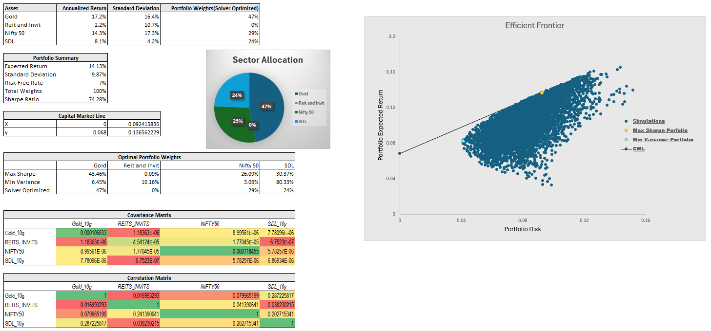

# Monte Carlo Portfolio Optimization with Indian Market Assets

## Table of Contents

- [Project Overview](#project-overview)
- [Investment Universe](#investment-universe)
- [Key Results](#key-results)
- [Investment Insights](#investment-insights)
- [Future Enhancements](#future-enhancements)
- [Acknowledgments](#acknowledgments)
- [Technical Methodology](#technical-methodology)

## Project Overview

This project implements Monte Carlo simulation for portfolio optimization using four diverse Indian market assets. The analysis combines Modern Portfolio Theory with advanced Excel-based Monte Carlo methods to identify optimal portfolio weights that maximize the Sharpe ratio while effectively managing risk exposure.

## Investment Universe

The portfolio consists of four distinct asset classes from the Indian market:

*   **Gold:** Physical gold (10 gms) pricing from NSE
*   **REITs & InvITs:** Real Estate and Infrastructure Investment Trusts Index
*   **Equity:** Nifty 50 Index representing large-cap Indian equities
*   **Fixed Income:** State Development Loans (SDL) for sovereign debt exposure
*   **Analysis Period:** July 2019 - December 2023

## Key Results

Three key portfolio allocations were identified:

*   **Maximum Sharpe Ratio Portfolio:**
    *   Gold: 43.46%
    *   REITs/InvITs: 0.09%
    *   Nifty 50: 26.09%
    *   SDL: 30.37%

*   **Minimum Variance Portfolio:**
    *   Gold: 6.45%
    *   REITs/InvITs: 10.16%
    *   Nifty 50: 3.06%
    *   SDL: 80.33%

*   **Solver Optimized Portfolio:**
    *   Gold: 47%
    *   REITs/InvITs: 0%
    *   Nifty 50: 29%
    *   SDL: 24%

### Key Metrics of Optimized Portfolio

*   **Expected Portfolio Return:** 14.13%
*   **Portfolio Volatility:** 9.87%
*   **Annualized Sharpe Ratio:** 74.28% 
*   **Risk-Free Rate:** 6.8% (based on 10-year government security yield)

## Investment Insights

### Asset Class Analysis

1.  **Gold (47% Allocation):**
    *   Highest individual return (17.2%)
    *   Strong diversification benefits
    *   Effective hedge against market volatility

2.  **Nifty 50 (29% Allocation):**
    *   Robust equity returns (14.3%)
    *   Provides growth exposure
    *   Balanced against fixed income

3.  **SDL (24% Allocation):**
    *   Lowest volatility (4.2%)
    *   Stable income component
    *   Enhanced risk-adjusted returns

4.  **REITs/InvITs (0% Allocation):**
    *   Excluded from the optimal portfolios due to its inferior risk-return characteristics. While offering a modest return of 2.2%, this asset class exhibited relatively high volatility (10.7%) compared to other available investment options, making it a less attractive choice for maximizing the Sharpe ratio.

## Future Enhancements

1.  **Methodology Extensions:**
    *   Dynamic risk-free rate implementation
    *   Rolling window analysis for robustness
    *   Conditional Value at Risk (CVaR) optimization

2.  **Additional Features:**
    *   Transaction cost modeling
    *   Rebalancing strategy development
    *   Sector concentration limits

## Acknowledgments

*   NSE India for market data
*   NIFTY Indices methodology documentation
*   Modern Portfolio Theory framework

## Technical Methodology

For a detailed explanation of the technical methods used in this project, please see the [Technical Methodology](TechnicalMethodology.md) document.